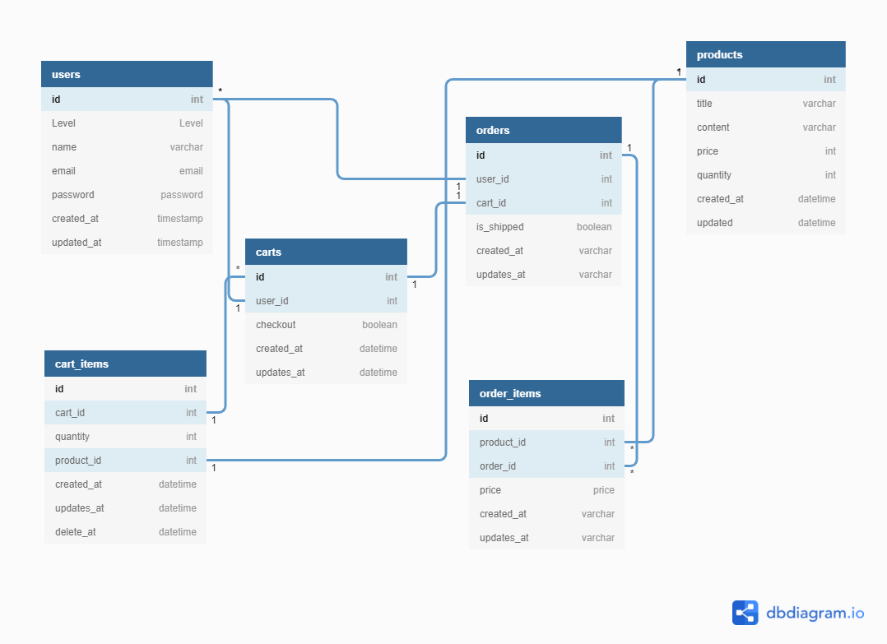

### 實作具電商功能 API Server
### 實作出一個 API 應用程式，並具有基本電商的購物和會員功能。

#### 功能列表:

1. Cart 購物車功能，可以建立、讀取、編輯( 添加產品 )和移除產品

2. Auth 會員註冊、登入與登出功能

3. 結帳功能 + VIP 優惠 + 商品數量檢查防呆

#### 系統功能:

1. 使用 Eloquent Model 完成功能

2. 有使用軟刪除特性

3. 有資料 Validator

4. 有資料預產生器 Seeder

#### Postman作品DEMO

#### SQL架構

